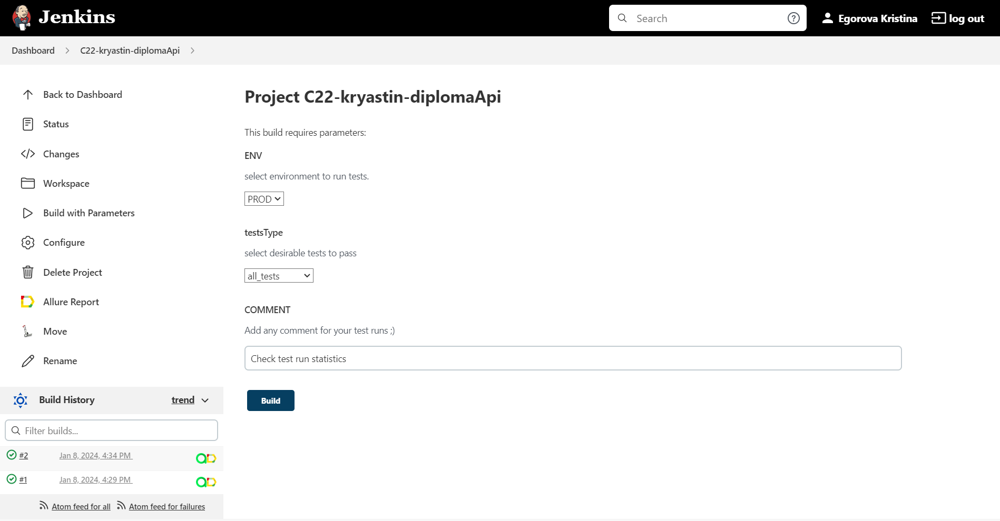
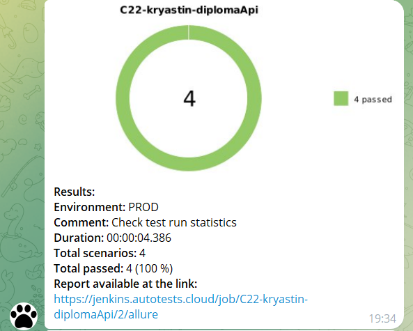

# API test automation project for open-source [The Cat API](https://thecatapi.com/)
<center></center>

> The Cat API provides a huge amount of cat images that could be used in your project. It also allows a user to save image as favotite or search for specified cat breed.
## Summary
+ [About the project](#about)
+ [Tools and Technologies](#tools)
+ [How to run](#launch)
+ [Run in Jenkins](#jenkins)
+ [Telegram Notifications](#telegram)
+ [Report in Allure Report](#allure-report)
+ [Allure TestOps Integration](#allureTO)

<a id="about"></a>
## About the project
The project consists of Rest API tests. A brief list of interesting facts:
- [x] `Lombok` for models in API tests
- [x] Config with `Owner` library
- [x] Using request/response specifications for API tests
- [x] Custom Allure listener for beautiful API requests/responses logging
- [x] Autotests as test documentation
- [x] Run tests by `Tags` or all at once

<a id="tools"></a>
## Tools and Technologies
<a href="https://www.java.com/en/"></a>
<a href="https://gradle.org/"></a>
<a href="https://github.com/"></a>
<a href="https://github.com/"></a>
<a href="https://www.jetbrains.com/idea/"></a>
<a href="https://junit.org/junit5/"></a>
<a href="https://www.jenkins.io/"></a>
<a href="https://github.com/allure-framework/"></a>
<a href="https://qameta.io/"></a>
<a href="https://telegram.org/"></a>

The project is written in `Java` using `RestAssured` library.
- `Gradle` - is used as a build automation tool.
- `JUnit5` - to execute tests.
- `RestAssured` - for creating tests.
- `Jenkins` - is CI/CD for running tests remotely.
- `Telegram Bot` - for test results notifications.
- `Allure Report` - for test results visualisation.
- `Allure TestOps` - as Test Management System.

<a id="launch"></a>
## How to run
> [!IMPORTANT]
> Be sure you have installed: Java, Gradle and IDE
> Before running tests, you should ask service for access token and set up in the auth.properties file. It's free :)

Tests are divided by different features, it is possible to run not only all tests but also by feature tags.  
Available feature test runs are:
- all_tests
- image_tests
- favorite_tests

Use the following command to run all tests:
```
gradle clean all_tests
```

<a id="jenkins"></a>
## Run in [Jenkins](https://jenkins.autotests.cloud/job/C22-kryastin-diplomaApi/)

Build with parameters allows to customize your test run. For example, different environments to run.



<a id="telegram"></a>
## Telegram Notifications

Telegram bot sends a brief report to a specified telegram chat by results of each build.



<a id="allure-report"></a>
## Report in [Allure Report](https://jenkins.autotests.cloud/job/C22-kryastin-diplomaApi/allure/)
Main page with common information


List of tests with steps and test artefacts


<a id="allureTO"></a>
## Allure [TestOps Integration](https://allure.autotests.cloud/project/3932/dashboards)
>Test-cases in the project are imported and constantly updated from the code, so there is no need in complex process of synchronization manual test-cases and autotests.  
>It is enough to create and update an autotest in the code and the test-case in TMS always will be in actual state.  
>Manual test-cases also can be added in TMS in case of need (via web interface or via code).
### Dashboard preview

  

### Test cases

  
